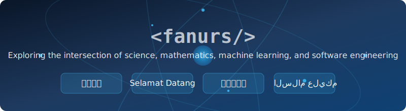

- 🎓 Recently graduated with a PhD in Nuclear Physics from Michigan State University

- 💻 Most commonly used languages: _Python, C++, JavaScript/TypeScript_

- 🌱 Nowadays exploring: _[Rust](https://www.rust-lang.org/), [Microsoft Azure](https://azure.microsoft.com/en-us/), [Graph Neural Network (GNN)](https://distill.pub/2021/gnn-intro/)_

- 🧠 Here is a small part of my external brain: 

### Contacts

  

